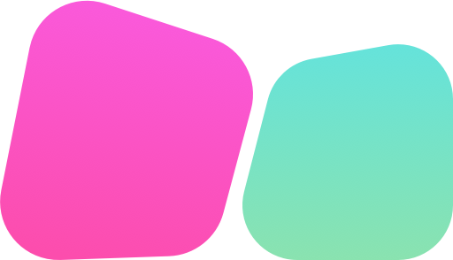

# react-native-3dcube-navigation

### Installation

##### With Yarn

```bash
$ yarn add react-native-3dcube-navigation
```

##### With NPM

```bash
$ npm i react-native-3dcube-navigation --save
```

### Demo


### Basic Usage

##### Horizontal
```js
import { CubeNavigationHorizontal } from 'react-native-3dcube-navigation'

<View style={styles.father} >
  <CubeNavigationHorizontal ref={view => { this.cube = view; }}>
    <View style={[styles.container, { backgroundColor: '#5CDB8B' }]}>
      <Text style={styles.text}>Horizontal Page 1</Text>
    </View>
    <View style={[styles.container, { backgroundColor: '#A3F989' }]}>
      <Text style={styles.text}>Horizontal Page 2</Text>
    </View>
    <View style={[styles.container, { backgroundColor: '#CBF941' }]}>
      <Text style={styles.text}>Horizontal Page 3</Text>
    </View>
  </CubeNavigationHorizontal>
</View >
```

##### Vertical
```js
import { CubeNavigationVertical } from 'react-native-3dcube-navigation'

<View style={styles.father} >
  <CubeNavigationVertical ref={view => { this.cube = view; }}>
    <View style={[styles.container, { backgroundColor: '#5CDB8B' }]}>
      <Text style={styles.text}>Vertical Page 1</Text>
    </View>
    <View style={[styles.container, { backgroundColor: '#A3F989' }]}>
      <Text style={styles.text}>Vertical Page 2</Text>
    </View>
    <View style={[styles.container, { backgroundColor: '#CBF941' }]}>
      <Text style={styles.text}>Vertical Page 3</Text>
    </View>
  </CubeNavigationVertical>
</View >
```

### Properties

| Prop  | Default  | Type | Description |
| :------------ |:---------------:| :---------------:| :-----|
| expandView | false | `bool` | If `true`, the view expands not showing the background |
| scrollLockPage | null | `number` | Lock swipe to the next pages, referring the index number of the page |
| responderCaptureDx | 60 | `number` | The increment at which the responder captures the touch |
| callBackAfterSwipe | null | `function` | Callback function after release |
| callbackOnSwipe | null | `function` | Callback function on start swipe & release, callback's first argument `started` defines if it's the start of the swipe or the release  |

### Methods

#### scrollTo(index, animated)

| Name  | Type     | default | Description |
| :---- | :------: | :------: | :--- |
| index | `number`   | `undefined` | Scroll to the page, start in 0. |
| animated | `bool`   | `true` |  |

### Examples

```bash
$ cd examples
$ npm i
$ react-native run-ios
```

<br/>

> Inspired by [tlackemann](https://github.com/tlackemann/react-native-cube-transition) but implemented only with react-native libs.
